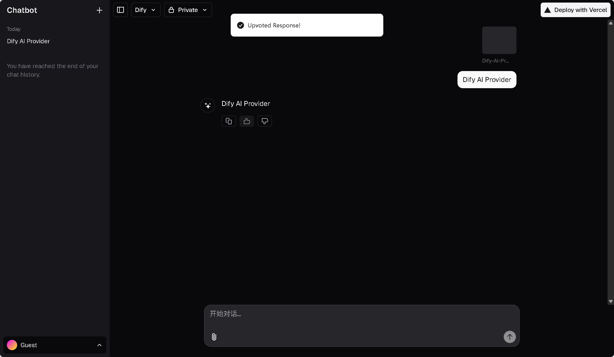

<a href="https://www.aibangxuanxing.com/">
  
  <h1 align="center">Chat SDK</h1>
</a>

## 说明

- 本项目基于 Vercel 生态的对话应用 [ai-chatbot](https://github.com/vercel/ai-chatbot) 和 [ai-sdk](https://github.com/vercel/ai) 构建，支持 Dify 对话和文件上传功能。
  * ai-chatbot 更新于 2025-05-25 的版本
  * 应用路由使用的函数是 'streamText'，所以调用 Dify 时 'response_mode: streaming'。
  * 上传文件类型和大小限制需和 Dify 后台一致。

- 部署流程见原项目 [README.md](https://github.com/iChuck-W/ai-chatbot-dify-provider/blob/main/README_EN.md)

## 核心文件

- 为 Dify 创建的独立文件：
  * lib/ai/dify/src：Dify “AI SDK”
  * app/(chat)/api/chat-dify/route.ts
  * app/(chat)/api/files-dify/upload/route.ts
  * components/multimodal-input-dify.tsx

- 接入新模型，增加自定义模型 id：selectedChatModel: z.enum(['dify'])
  * lib/ai/entitlements.ts
  * lib/ai/models.ts
  * lib/ai/providers.ts
  * app/(chat)/api/chat-dify/schema.ts

- 增加筛选条件 initialChatModel，为不同模型页面选择不同的渲染组件
  * components/artifacts.tsx
  * components/chat.tsx
  * components/messages.tsx
  * components/multimodal-input.tsx

- id 匹配，保证对话连续性
  * pgTable('Chat') 扩展 difyConversationId 字段
  * 应用 chatId 与 difyConversationId 匹配

- 搜索 "// console.log"，去除备注符号运行，可以了解数据传递路径和字段。

## 参考资料

- [Dify API Reference](https://docs.dify.ai/api-reference/)

- [packages/provider/src/language-model/v1](https://github.com/vercel/ai/tree/main/packages/provider/src/language-model/v1)
> 语言模型的核心接口，定义了模型必须实现的方法和属性，主要依赖于 @ai-sdk/provider 和 @ai-sdk/provider-utils

- [streamText](https://ai-sdk.dev/docs/reference/ai-sdk-core/stream-text)

- [community-providers](https://ai-sdk.dev/providers/community-providers)
  - [Qwen Provider](https://ai-sdk.dev/providers/community-providers/qwen)
  - [Zhipu AI Provider](https://ai-sdk.dev/providers/community-providers/zhipu)
  - [Dify Provider](https://ai-sdk.dev/providers/community-providers/dify)
